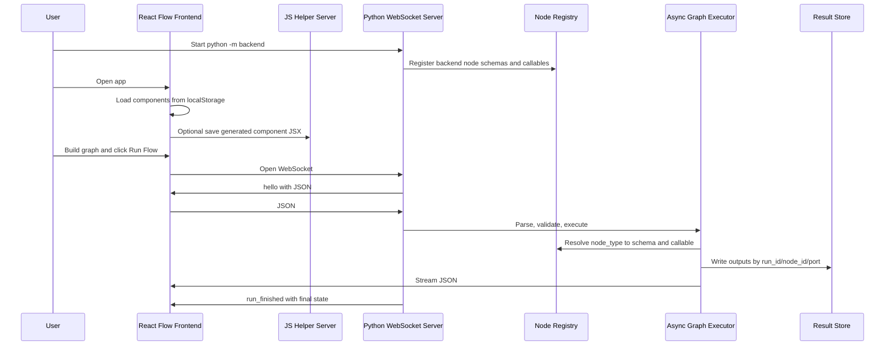

# BertLike Data Flow

This document explains what currently happens in the application from startup to the end of a workflow run. It describes the real code paths that exist now, plus the intended role of the three JSON contracts.

## Runtime Pieces

The platform currently has three main runtime pieces:

1. Frontend React app
   - Entry point: `src/main.jsx`
   - Flow canvas: `src/flow.jsx`
   - Uses React Flow for visual nodes and edges.
   - Stores builder-created components in browser `localStorage`.

2. Local JavaScript helper server
   - File: `server.mjs`
   - Handles component JSX generation through `POST /api/components`.
   - Handles file uploads through `POST /api/files`.
   - Has an older `POST /api/run` logger endpoint, but the new run path uses the Python WebSocket backend instead.

3. Python execution backend
   - Entrypoint: `backend/__main__.py`
   - WebSocket server: `backend/ws_server.py`
   - Core models: `backend/core/models.py`
   - Registry: `backend/core/registry.py`
   - Validation: `backend/core/validator.py`
   - Executor: `backend/core/executor.py`
   - Result store and cache boundary: `backend/core/result_store.py`
   - Built-in node callables: `backend/nodes/builtin.py`

## High Level Flow



## Startup Phase

### 1. Python Backend Startup

The backend starts with:

```powershell
python -m backend --host 127.0.0.1 --port 8765
```

or:

```powershell
.\run-backend.ps1
```

The startup path is:

1. `backend/__main__.py` imports and calls `backend.ws_server.main()`.
2. `main()` parses `--host` and `--port`.
3. `main()` calls `asyncio.run(run_server(host, port))`.
4. `run_server()` creates `WorkflowWebSocketServer()`.
5. `WorkflowWebSocketServer.__init__()` creates:
   - `self.registry`
   - `self.result_store`
   - `self.cache`
6. If no registry is passed in, `build_registry()` is called.
7. `build_registry()` creates a `NodeRegistry`.
8. `register_builtin_nodes(registry)` adds the current built-in nodes:
   - `prompt_builder`
   - `brahim_&_youcef_demo`
   - `output`
9. The WebSocket server starts listening with `websockets.asyncio.server.serve`.

At this point, the backend is ready to accept WebSocket connections at:

```text
ws://127.0.0.1:8765/ws
```

Important backend state created at startup:

```text
NodeRegistry
  node_type -> RegisteredNode(schema, callable)

InMemoryResultStore
  result_store[run_id][node_id][port_name] -> actual output value

InMemoryExecutionCache
  hash(node_type + args + inputs) -> cached output object
```

### 2. Frontend Startup

The frontend entry point is `src/main.jsx`.

When the browser loads the app:

1. React mounts `Root`.
2. `Root` starts in `builder` mode.
3. The builder calls `loadComponents()`.
4. `loadComponents()` reads:

```text
localStorage["bertlike.component-builder.components"]
```

5. If saved components exist, they are loaded.
6. If not, the frontend creates a starter component named `Prompt Builder`.
7. The selected component is rendered in the builder canvas.
8. Builder edits are persisted back to `localStorage`.
9. The builder also attempts to save the selected component to the local JS helper server with:

```http
POST /api/components
```

That server writes generated React node components into:

```text
src/components/generated/<ComponentName>.jsx
```

File fields use:

```http
POST /api/files
```

The uploaded file is stored in:

```text
files/<filename>
```

## JSON #1: Node Type Schema

### Purpose

JSON #1 is the source of truth for backend-supported node types.

It tells the frontend:

- which `node_type` values exist
- what each node is called
- which category it belongs to
- which input ports exist
- which output ports exist
- what type each port has
- which args are allowed
- which args are required

### Backend Source

The backend schema classes live in `backend/core/models.py`:

```text
NodeTypeSchema
PortDefinition
ArgDefinition
```

The registry class lives in `backend/core/registry.py`:

```text
NodeRegistry
RegisteredNode
```

Each registered node has two things:

```text
RegisteredNode(
  schema=<NodeTypeSchema>,
  callable=<Python function or async function>
)
```

That is the backend version of the two-representation node architecture:

```text
node_type -> schema + Python callable
```

Current built-in schemas are registered in `backend/nodes/builtin.py`.

Example:

```text
node_type: "brahim_&_youcef_demo"
inputs:
  input_2: string
  input_2_2: any
outputs:
  text: string
  output_2: any
  output_3: any
  output_4: any
args:
  file: string
  cach_results: boolean
  number_field: number
  checkbox_field: boolean
```

### How JSON #1 Is Sent

When a frontend opens a WebSocket connection, `WorkflowWebSocketServer.handle()` immediately sends:

```json
{
  "type": "hello",
  "protocol_version": 1,
  "node_types": [
    {
      "node_type": "brahim_&_youcef_demo",
      "label": "Brahim & Youcef Demo",
      "category": "Documents",
      "ports": {
        "inputs": [],
        "outputs": []
      },
      "args_schema": []
    }
  ]
}
```

The real `ports` and `args_schema` arrays are generated by:

```text
NodeRegistry.to_json()
NodeTypeSchema.to_json()
PortDefinition.to_json()
ArgDefinition.to_json()
```

The backend also supports an explicit request:

```json
{ "type": "get_node_types" }
```

The response is:

```json
{
  "type": "node_types",
  "node_types": []
}
```

### What The Frontend Currently Does With JSON #1

Current status:

The frontend opens a WebSocket only when `Run Flow` is clicked. It receives the `hello` message and logs it, but it does not yet use JSON #1 to build the visual component library.

Current frontend source of node definitions:

```text
localStorage["bertlike.component-builder.components"]
```

Current frontend mapping functions in `src/flow.jsx`:

```text
toContractName()
buildPortNameMap()
getComponentContract()
```

These functions convert visual component labels into backend contract names.

For example:

```text
Component name: "Brahim & youcef demo"
node_type:      "brahim_&_youcef_demo"

Port label: "Input 2"
port name:  "input_2"

Duplicate port label: "Input 2"
second name:          "input_2_2"
```

This duplicate-safe mapping matters because the backend schema has concrete port names, but the React Flow handles are browser-generated ids like:

```text
port-15fd6b21-0750-45c7-94f8-9ed54f33d495
```

The run request must not send those frontend handle ids. It must send backend port names.

Future intended use:

1. Frontend loads JSON #1 on app startup.
2. Frontend builds the node palette from backend schemas.
3. Frontend uses backend port names directly instead of deriving them from labels.
4. Frontend validates connections against JSON #1 before letting the user connect ports.
5. Backend still validates again before execution.

## Building A Flow In The Frontend

The flow page is implemented in `src/flow.jsx`.

When the user switches to Flow mode:

1. `Flow()` loads saved components from `localStorage`.
2. It keeps these React state values:

```text
savedComponents
selectedComponentId
nodes
edges
runStatus
isRunning
```

3. It also keeps refs:

```text
nodesRef
edgesRef
```

These refs allow `runFlow()` to read the latest graph without forcing unnecessary React rerenders.

### Adding A Node

When the user clicks `Add Component`:

1. `addSelectedComponent()` checks the selected saved component.
2. It clones the component with `cloneComponent()`.
3. It creates a React Flow node:

```js
{
  id: "flow-node-<uuid>",
  type: "savedComponent",
  position: { x, y },
  data: {
    component: <cloned component>,
    onFieldChange: updateNodeField
  }
}
```

4. React Flow renders the node using `SavedComponentNode`.
5. The node UI renders:
   - input handles from `component.inputs`
   - editable field controls from `component.fields`
   - output handles from `component.outputs`

### Editing Node Args

Each visual field becomes a future backend arg.

Example visual field:

```json
{
  "id": "field-337545ca-5e3e-4705-8e04-21547c16084c",
  "label": "Number Field",
  "type": "number",
  "value": 8
}
```

When the user edits it:

1. `FlowFieldInput` calls `onChange(value)`.
2. `FlowFieldRow` calls `onFieldChange(nodeId, fieldId, value)`.
3. `updateNodeField()` updates the matching node in React state.
4. Later, `runFlow()` maps this field into:

```json
{
  "number_field": 8
}
```

The cache toggle is special:

```text
field label "Use Cache" or field id "field-cache" -> node.config.cache
```

All other fields become `args`.

### Connecting Nodes

When the user connects two handles:

1. React Flow calls `onConnect(params)`.
2. The frontend finds:
   - source node
   - target node
   - source output port
   - target input port
3. `arePortTypesCompatible(sourceType, targetType)` checks the visual port types.
4. If incompatible, the edge is rejected in the frontend and `runStatus` is updated.
5. If compatible, the new edge is added.
6. Existing edges into the same target handle are removed so each input handle only has one incoming edge.

This is frontend validation only. The backend repeats validation using JSON #1 before execution.

## JSON #2: Run Request

### Purpose

JSON #2 is the complete backend execution request.

It contains:

- run metadata
- execution config
- node instances
- node args
- per-node cache config
- edges using backend port names

It intentionally does not contain:

- React Flow positions
- zoom/pan state
- frontend selection state
- execution state
- large output payloads

### When JSON #2 Is Created

JSON #2 is created only when the user clicks:

```text
Run Flow
```

The function is:

```text
src/flow.jsx -> runFlow()
```

### Frontend Run Request Construction

`runFlow()` reads:

```text
nodesRef.current
edgesRef.current
```

Then it creates:

```json
{
  "run_id": "run-<uuid>",
  "flow_id": "flow_abc123",
  "schema_version": 1,
  "flow_revision": 1,
  "created_at": "2026-05-07T...",
  "execution_config": {
    "timeout_seconds": 120,
    "on_node_failure": "halt",
    "max_retries": 0
  },
  "nodes": {},
  "edges": []
}
```

Execution config comes from Vite env values if present:

```text
VITE_EXECUTION_TIMEOUT_SECONDS
VITE_EXECUTION_ON_NODE_FAILURE
VITE_EXECUTION_MAX_RETRIES
```

Otherwise it defaults to:

```json
{
  "timeout_seconds": 120,
  "on_node_failure": "halt",
  "max_retries": 0
}
```

### Node Mapping

For each React Flow node:

Frontend node:

```js
{
  id: "flow-node-dadd1c27-...",
  data: {
    component: {
      name: "Brahim & youcef demo",
      fields: [],
      inputs: [],
      outputs: []
    }
  }
}
```

becomes backend node instance:

```json
{
  "flow-node-dadd1c27-...": {
    "node_type": "brahim_&_youcef_demo",
    "args": {
      "file": "",
      "cach_results": true,
      "number_field": 8,
      "checkbox_field": false
    },
    "config": {
      "cache": false
    }
  }
}
```

Important distinction:

```text
node_type = logic identity
node id   = instance identity and result-store identity
args      = instance config
```

This means two nodes can have the same `node_type` but different ids and args.

### Edge Mapping

React Flow edges contain frontend handle ids:

```js
{
  source: "flow-node-a",
  sourceHandle: "port-2a378414-...",
  target: "flow-node-b",
  targetHandle: "port-15fd6b21-..."
}
```

The backend does not want frontend handle ids. It wants port names from the node type schema.

So `runFlow()` maps handles to contract port names:

```text
sourceHandle -> source component output label -> backend from_port
targetHandle -> target component input label -> backend to_port
```

Result:

```json
{
  "id": "xy-edge__...",
  "from": "flow-node-a",
  "from_port": "text",
  "to": "flow-node-b",
  "to_port": "input_2"
}
```

### Sending JSON #2

After building the payload:

1. Frontend sets:

```text
isRunning = true
runStatus = "Connecting to backend..."
```

2. Frontend opens:

```js
new WebSocket(BACKEND_WS_URL)
```

Default:

```text
ws://127.0.0.1:8765/ws
```

3. On socket open, frontend sends:

```json
{
  "type": "run",
  "payload": {
    "...": "JSON #2"
  }
}
```

## Backend Handling Of JSON #2

The message is received by:

```text
WorkflowWebSocketServer.handle()
```

It parses raw WebSocket text as JSON and passes it to:

```text
WorkflowWebSocketServer._handle_message()
```

For a run message:

```python
if message_type == "run":
    request = RunRequest.from_dict(message.get("payload"))
```

### Parsing Into Backend Models

`RunRequest.from_dict()` converts the raw JSON object into typed dataclasses:

```text
RunRequest
ExecutionConfig
NodeInstance
NodeConfig
Edge
```

This step checks basic shape:

- run request must be an object
- nodes must be an object
- edges must be an array
- each node must include `node_type`
- each node `args` must be an object
- each edge must include `id`, `from`, `from_port`, `to`, `to_port`
- `on_node_failure` must be `halt`, `skip`, or `retry`

After parsing succeeds, the backend sends:

```json
{
  "type": "run_accepted",
  "run_id": "run-..."
}
```

Accepted means the JSON shape parsed. It does not yet mean graph validation passed.

### Creating The Executor

The server creates:

```python
AsyncGraphExecutor(
    registry=self.registry,
    result_store=self.result_store,
    cache=self.cache,
    event_sink=send,
)
```

This executor uses the same registry, result store, and cache that were created at server startup.

Then it calls:

```python
final_state = await executor.execute(request)
```

## Backend Validation

The first thing `AsyncGraphExecutor.execute()` does is:

```python
plan = validate_run_request(request, self.registry)
```

Validation lives in:

```text
backend/core/validator.py
```

### Node Validation

For every node instance:

1. Check `node_type` exists in `NodeRegistry`.
2. Load the `NodeTypeSchema`.
3. Check required args.
4. Check arg value types.
5. Reject unknown args.

Example:

```text
node_type "brahim_&_youcef_demo" must have args declared by that schema.
```

If the frontend sends:

```json
{
  "number_field": "not a number"
}
```

backend validation rejects it because `number_field` is declared as `number`.

### Edge Validation

For every edge:

1. Check edge id is unique.
2. Check source node exists.
3. Check target node exists.
4. Reject self dependencies.
5. Resolve source node schema.
6. Resolve target node schema.
7. Check source output port exists.
8. Check target input port exists.
9. Check source output type is compatible with target input type.
10. Reject multiple incoming edges into the same input port.
11. Build dependency maps.

The important backend maps are:

```text
incoming_edges[target_node_id] -> list[Edge]
outgoing_edges[source_node_id] -> list[Edge]
dependencies[node_id] -> set[upstream_node_ids]
dependents[node_id] -> set[downstream_node_ids]
```

### Cycle Detection

The validator uses topological ordering.

If topological order does not include every node, at least one cycle exists.

In that case the backend rejects the run:

```json
{
  "type": "run_rejected",
  "status": "failed",
  "errors": [
    "graph contains at least one cycle"
  ]
}
```

### Connected Components

The validator also finds connected components by treating dependencies and dependents as undirected neighbors.

Example:

```text
Component 1: A -> B -> C
Component 2: D -> E
Component 3: F
```

The backend does not ask the user which component to run.

All components are included in the same execution plan. Nodes with no unsatisfied dependencies become ready immediately, even if they belong to different components.

The executor emits connected component data in the first execution state event:

```json
{
  "type": "execution_state",
  "event": "run_started",
  "connected_components": [
    ["A", "B", "C"],
    ["D", "E"],
    ["F"]
  ],
  "state": {}
}
```

## JSON #3: Execution State

### Purpose

JSON #3 is backend-owned execution state.

The frontend does not send it.

The backend initializes it, mutates it, and streams it during execution.

### State Initialization

After validation succeeds:

```python
state = ExecutionState.for_request(request)
```

This creates:

```text
ExecutionState
  run_id
  flow_id
  status = "pending"
  started_at = None
  completed_at = None
  node_states[node_id] = NodeState()
```

Each node starts as:

```json
{
  "status": "pending",
  "outputs": {},
  "error": null,
  "cached": false,
  "started_at": null,
  "completed_at": null,
  "attempts": 0
}
```

Then the executor sets:

```text
state.status = "running"
state.started_at = now
```

and emits:

```json
{
  "type": "execution_state",
  "event": "run_started",
  "state": {
    "run_id": "run-...",
    "flow_id": "flow_abc123",
    "status": "running",
    "started_at": "...",
    "completed_at": null,
    "node_states": {
      "node-a": {
        "status": "pending",
        "outputs": {},
        "error": null,
        "cached": false,
        "started_at": null,
        "completed_at": null,
        "attempts": 0
      }
    }
  }
}
```

### Frontend Handling Of JSON #3

The frontend receives every WebSocket message in:

```text
src/flow.jsx -> socket.addEventListener("message", ...)
```

For each message:

1. It parses `event.data`.
2. It logs the full backend message to the browser console.
3. It calls `summarizeRunMessage(message)`.
4. It updates `runStatus` in the toolbar.

Current frontend behavior is intentionally simple:

```text
JSON #3 is displayed as a textual run status.
```

Future intended behavior:

```text
JSON #3 should update each React Flow node visually:
  pending   -> neutral
  running   -> active
  completed -> success
  failed    -> error
  skipped   -> muted
  cached    -> cache indicator
```

## Execution Algorithm

Execution happens in:

```text
backend/core/executor.py
```

The executor uses Kahn's algorithm with wave execution.

### Ready Node Selection

After validation, the executor creates:

```python
remaining_deps = {
    node_id: set(upstream_nodes)
}
```

It finds the first ready wave:

```python
ready = sorted(
    node_id
    for node_id, upstream in remaining_deps.items()
    if not upstream
)
```

These are all nodes with no upstream dependency.

This can include:

- source nodes
- isolated nodes
- source nodes from multiple disconnected components

### Wave Execution

For each wave:

1. Emit:

```json
{
  "type": "execution_state",
  "event": "wave_started",
  "nodes": ["node-a", "node-d"],
  "state": {}
}
```

2. Run all nodes in that wave concurrently:

```python
await asyncio.gather(
    *(self._run_or_skip_node(...) for node_id in wave)
)
```

3. If any node failed and `on_node_failure` is `halt`, stop scheduling more nodes.
4. Otherwise, remove completed wave nodes from dependency sets.
5. Any child whose dependencies are now empty becomes ready for the next wave.

Example graph:

```text
A -> C
B -> C
D -> E
F
```

Execution waves:

```text
Wave 1: A, B, D, F
Wave 2: C, E
```

`A`, `B`, `D`, and `F` run in parallel because they have no dependencies.

`C` waits for both `A` and `B`.

`E` waits for `D`.

## Node Execution

For each node, `_execute_node()` does the following.

### 1. Gather Inputs From Result Store

The executor looks at incoming edges:

```python
inputs = {
    edge.to_port: self.result_store.get(
        request.run_id,
        edge.from_node,
        edge.from_port
    )
    for edge in plan.incoming_edges[node_id]
}
```

Example edge:

```json
{
  "from": "node-a",
  "from_port": "text",
  "to": "node-b",
  "to_port": "input_2"
}
```

If `node-a` previously wrote:

```text
result_store["run-1"]["node-a"]["text"] = "hello"
```

Then `node-b` receives:

```json
{
  "input_2": "hello"
}
```

### 2. Create NodeContext

The executor builds:

```python
NodeContext(
    run_id=request.run_id,
    node_id=node_id,
    node_type=node.node_type,
    args=node.args,
    inputs=inputs,
)
```

This is what every Python node callable receives.

Node callables do not need to know about React Flow.

They only receive:

```text
args   = instance parameters
inputs = upstream output values mapped by input port name
```

### 3. Cache Lookup

Before calling the node:

```python
cache_key = hash(node_type + args + inputs)
```

If:

```json
{
  "config": {
    "cache": true
  }
}
```

then the executor checks:

```text
InMemoryExecutionCache[cache_key]
```

If found:

1. The callable is skipped.
2. Cached outputs are used.
3. `node_state.cached = true`.
4. The cached outputs are still written into the current run's result store.

This is important because the run-specific result refs still need to exist:

```text
store://current_run_id/node_id/port
```

### 4. Call Python Logic

The registry resolves:

```text
node.node_type -> RegisteredNode(schema, callable)
```

Then the executor calls the callable.

If it is async:

```python
await callable(context)
```

If it is sync:

```python
await asyncio.to_thread(callable, context)
```

Both paths are wrapped in:

```python
asyncio.wait_for(..., timeout=request.execution_config.timeout_seconds)
```

So a stuck node cannot run forever.

### 5. Validate Outputs

Every node callable must return:

```python
dict[str, Any]
```

The keys must match declared output ports in JSON #1.

The executor checks:

- required outputs are present
- output values match declared port types
- no undeclared output ports are returned

If a node returns:

```python
{"wrong_port": "hello"}
```

and the schema only declares:

```text
text
```

the backend marks that node as failed.

### 6. Store Outputs

Valid outputs are written to:

```text
result_store[run_id][node_id][port_name]
```

Example:

```text
result_store["run-123"]["flow-node-a"]["text"] = "hello"
```

The execution state does not include the large output value.

It includes a reference:

```json
{
  "outputs": {
    "text": "store://run-123/flow-node-a/text"
  }
}
```

This is the reference pattern that will later support:

- images
- embeddings
- documents
- large JSON payloads
- binary artifacts
- Redis or object storage

## Failure Behavior

The run request controls failure behavior:

```json
{
  "execution_config": {
    "on_node_failure": "halt",
    "max_retries": 0
  }
}
```

### halt

If a node fails:

1. The node state becomes `failed`.
2. The current wave finishes.
3. No new waves are scheduled.
4. The run status becomes `failed`.

### skip

If a node fails:

1. The node state becomes `failed`.
2. The executor continues scheduling nodes whose dependencies are satisfied.
3. Any node depending on the failed node becomes `skipped`.
4. The run status becomes `partial`.

### retry

If a node fails:

1. The executor retries that same node.
2. Attempts are counted in `node_state.attempts`.
3. The maximum number of extra retries is `max_retries`.
4. If all attempts fail, the node becomes `failed`.

Current code only enables retry attempts when:

```text
on_node_failure == "retry"
```

## Completion

When there are no more ready nodes, or execution halts:

1. The executor calculates final run status.
2. It sets:

```text
state.completed_at = now
```

3. It emits:

```json
{
  "type": "execution_state",
  "event": "run_completed",
  "state": {}
}
```

4. `AsyncGraphExecutor.execute()` returns final `ExecutionState`.
5. The WebSocket server sends:

```json
{
  "type": "run_finished",
  "run_id": "run-...",
  "state": {}
}
```

6. The frontend receives `run_finished`.
7. The frontend resolves the run promise.
8. The frontend sets:

```text
isRunning = false
runStatus = "Run completed"
```

or another final status such as:

```text
Run failed
Run partial
```

## End To End Example

Assume this graph:

```text
demo-a.text -> demo-b.input_2
demo-b.text -> output.text
```

### Frontend Sends JSON #2

```json
{
  "run_id": "run-123",
  "flow_id": "flow_abc123",
  "schema_version": 1,
  "flow_revision": 1,
  "created_at": "2026-05-07T11:35:06.421Z",
  "execution_config": {
    "timeout_seconds": 120,
    "on_node_failure": "halt",
    "max_retries": 0
  },
  "nodes": {
    "demo-a": {
      "node_type": "brahim_&_youcef_demo",
      "args": {
        "file": "",
        "cach_results": true,
        "number_field": 8,
        "checkbox_field": false
      },
      "config": {
        "cache": false
      }
    },
    "demo-b": {
      "node_type": "brahim_&_youcef_demo",
      "args": {
        "file": "",
        "cach_results": true,
        "number_field": 8,
        "checkbox_field": false
      },
      "config": {
        "cache": false
      }
    },
    "out": {
      "node_type": "output",
      "args": {},
      "config": {
        "cache": false
      }
    }
  },
  "edges": [
    {
      "id": "e1",
      "from": "demo-a",
      "from_port": "text",
      "to": "demo-b",
      "to_port": "input_2"
    },
    {
      "id": "e2",
      "from": "demo-b",
      "from_port": "text",
      "to": "out",
      "to_port": "text"
    }
  ]
}
```

### Backend Builds GraphPlan

```text
dependencies:
  demo-a: {}
  demo-b: {demo-a}
  out:    {demo-b}

dependents:
  demo-a: {demo-b}
  demo-b: {out}
  out:    {}

incoming_edges:
  demo-a: []
  demo-b: [e1]
  out:    [e2]

topo_order:
  demo-a, demo-b, out
```

### Backend Executes Waves

```text
Wave 1:
  demo-a

Wave 2:
  demo-b

Wave 3:
  out
```

### Result Store Evolves

After `demo-a`:

```text
result_store["run-123"]["demo-a"]["text"] = "<demo-a text>"
result_store["run-123"]["demo-a"]["output_2"] = {...}
result_store["run-123"]["demo-a"]["output_3"] = false
result_store["run-123"]["demo-a"]["output_4"] = 8
```

After `demo-b`:

```text
result_store["run-123"]["demo-b"]["text"] = "<demo-b text>"
```

The output node returns no outputs. It prints or collects its input and completes.

### Final JSON #3 State

The final state has:

```json
{
  "run_id": "run-123",
  "flow_id": "flow_abc123",
  "status": "completed",
  "started_at": "...",
  "completed_at": "...",
  "node_states": {
    "demo-a": {
      "status": "completed",
      "outputs": {
        "text": "store://run-123/demo-a/text",
        "output_2": "store://run-123/demo-a/output_2",
        "output_3": "store://run-123/demo-a/output_3",
        "output_4": "store://run-123/demo-a/output_4"
      },
      "error": null,
      "cached": false
    },
    "demo-b": {
      "status": "completed",
      "outputs": {
        "text": "store://run-123/demo-b/text"
      },
      "error": null,
      "cached": false
    },
    "out": {
      "status": "completed",
      "outputs": {},
      "error": null,
      "cached": false
    }
  }
}
```

## Current Gaps And Next Extension Points

### Frontend Should Fully Consume JSON #1

Right now JSON #1 is sent by the backend but not yet used as the frontend source of truth.

The next clean step is:

```text
On frontend app start:
  connect to backend
  request node_types
  build node palette from JSON #1
  store backend port names directly in component data
```

That removes label slugging as a required contract mechanism.

### Execution State Should Drive Node UI

Right now JSON #3 updates only the toolbar text.

Next:

```text
execution_state.node_states[node_id].status
  -> React Flow node visual state
```

Useful visual states:

```text
pending
running
completed
failed
skipped
cached
```

### Result Store Should Gain A Read API

The result store currently stores values in memory and exposes refs internally.

Next backend APIs:

```text
GET result by store ref
stream large result metadata
download binary outputs
preview text/image/document outputs
```

### Redis Can Replace In-Memory Stores

The current interfaces are intentionally small:

```text
InMemoryResultStore
InMemoryExecutionCache
```

Future Redis versions should preserve:

```text
set_node_outputs(run_id, node_id, outputs)
get(run_id, node_id, port)
ref(run_id, node_id, port)
make_key(node_type, args, inputs)
```

### Auth And Sessions

The correct insertion points are:

1. WebSocket connection authentication in `WorkflowWebSocketServer.handle()`.
2. Session/user ids added to `RunRequest`.
3. Result store keys scoped by user/session.
4. Cache policy deciding whether cache is shared globally, per user, or per project.
5. Run history persisted after `run_finished`.

### Logging And Run History

The executor already emits every important lifecycle event:

```text
run_started
wave_started
node_started
node_retrying
node_completed
node_failed
node_skipped
run_completed
```

A logging layer can subscribe at `_emit()` and persist:

```text
run_id
event
timestamp
node_id
status
error
duration
outputs refs
```

## The Core Principle

The frontend owns visual editing.

The backend owns execution truth.

That means:

```text
Frontend:
  positions
  handles
  UI state
  user interactions
  optimistic type checks

Backend:
  node schemas
  graph validation
  cycle rejection
  execution state
  scheduling
  retries
  result storage
  final truth
```

The system is designed so future features can attach without changing the core contract:

```text
JSON #1: What can exist
JSON #2: What to run
JSON #3: What is happening
```

